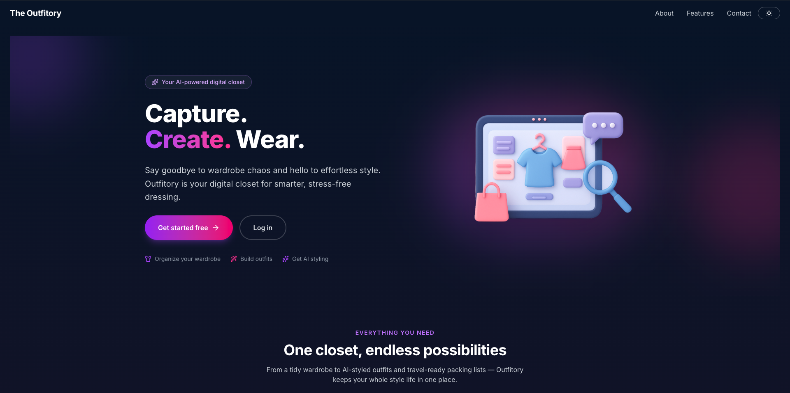
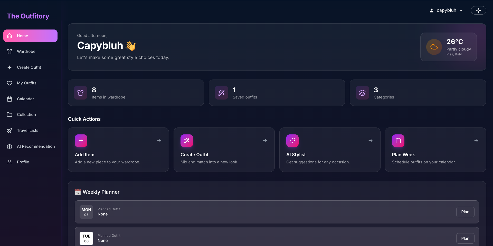
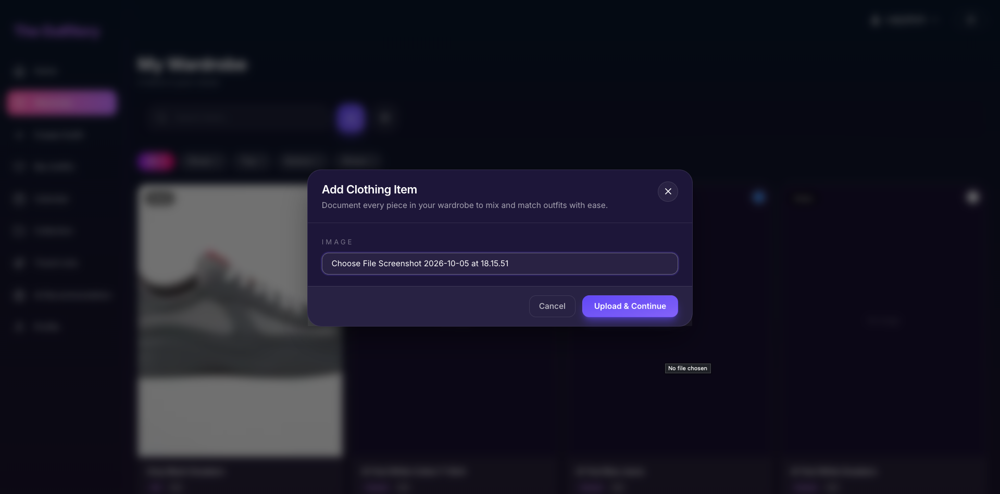
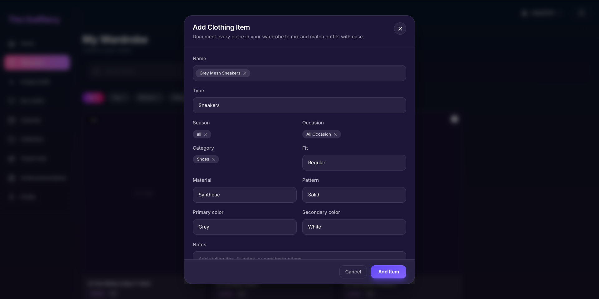
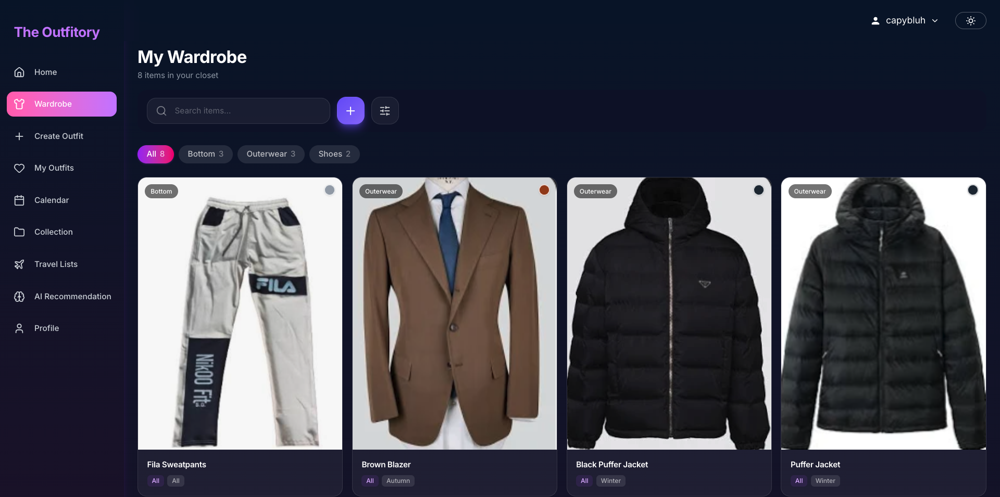
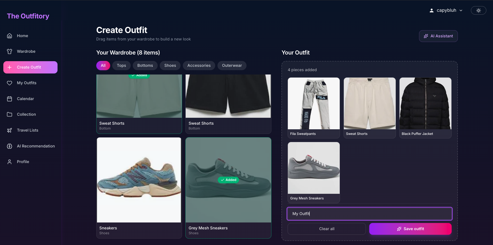
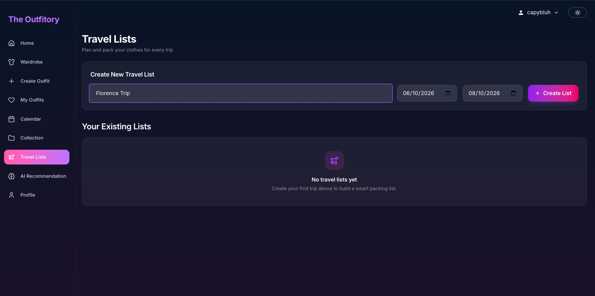
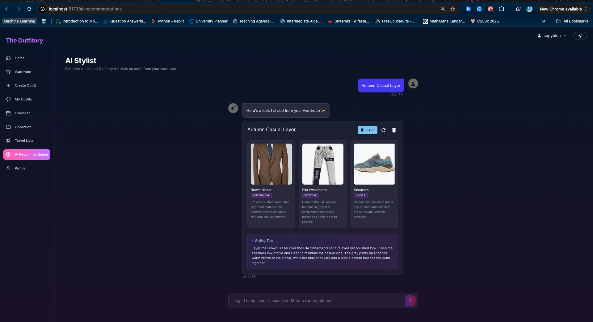

# Outfitory

Outfitory is a digital wardrobe and outfit-planning application. It keeps clothing, saved outfits, weekly plans, collections, and travel packing lists in one place. Clothing photos can be classified during upload, and the AI stylist builds recommendations from the items that are actually available in the user's wardrobe.

## What the application does

- Creates secure user accounts with JWT authentication.
- Stores clothing photos and details such as category, season, occasion, fit, material, pattern, and colour.
- Classifies uploaded clothing images and leaves the suggested details editable before saving.
- Searches and filters wardrobe items by category.
- Builds and saves outfits through a visual outfit creator.
- Produces AI outfit recommendations that adapt to the available wardrobe and requested season or occasion.
- Organises saved outfits into collections.
- Plans outfits on a weekly calendar.
- Creates dated packing lists for trips.
- Supports light and dark themes.

## Application walkthrough

### 1. Landing page

The landing page introduces the application and provides direct links to registration and login.



### 2. Dashboard

After signing in, the dashboard shows wardrobe and outfit totals, quick actions, weather information, and the weekly planner.



### 3. Upload a clothing image

New wardrobe items begin with an image upload. The file is stored by the backend and sent to the image classifier.



### 4. Review the classification

The classifier suggests a name, category, season, occasion, fit, material, pattern, and colours. Every value can be corrected before the item is saved.



### 5. Manage the wardrobe

Saved clothes appear in a searchable, filterable wardrobe with their images and key attributes.



### 6. Create an outfit manually

The outfit creator lets users select pieces from the wardrobe, review the combination, name it, and save it.



### 7. Prepare a travel list

Travel lists group clothes for a trip between selected start and end dates.



### 8. Ask the AI stylist

The stylist reads the current wardrobe and chooses compatible items without inventing unavailable clothes. Seasonal requests prefer matching and all-season pieces, while still working when a category such as tops or shoes is missing.



## Technology

| Area | Technology |
| --- | --- |
| Frontend | React 19, TypeScript, Vite, Tailwind CSS, React Router, Axios |
| Backend | Python, Flask, Flask-CORS, PyJWT, bcrypt |
| Database | MySQL 8 |
| Outfit recommendations | Groq API through LangChain |
| Image classification | Gemini vision API |
| Local development | Docker Compose |

## Project layout

```text
outfitory/
├── backend/
│   ├── db/                 MySQL schema and database files
│   ├── src/
│   │   ├── app.py          Flask application entry point
│   │   ├── routes/         API endpoints
│   │   ├── services/       Business, database, AI, and classification logic
│   │   └── requirements.txt
│   ├── uploads/            Uploaded clothing images
│   └── docker-compose.yaml
├── frontend/
│   └── src/
│       ├── components/     Shared and feature components
│       ├── contexts/       Application state
│       ├── pages/          Main screens
│       ├── services/       Backend API clients
│       └── styles/         Global styling
└── images/                 README screenshots
```

## Running the project

### Requirements

- Docker Desktop
- Node.js 18 or newer
- A Groq API key for outfit recommendations
- A Gemini API key for clothing-image classification

### 1. Configure the backend

Create `backend/.env` and add the required settings:

```env
DB_HOST=db
DB_USER=root
DB_PASSWORD=root
DB_NAME=outfitory

SECRET_KEY=replace_with_a_long_random_value
JWT_EXPIRATION_TIME=7200
ALGORITHM=HS256

GROQ_API_KEY=your_groq_api_key
GROQ_MODEL=openai/gpt-oss-20b

GEMINI_API_KEY=your_gemini_api_key
GEMINI_VISION_MODEL=gemini-flash-lite-latest
```

Do not commit `backend/.env`. It contains private credentials and is ignored by Git.

### 2. Start the API and database

```bash
docker compose -f backend/docker-compose.yaml up --build
```

The Flask API runs at `http://localhost:8000` and MySQL runs on port `3306`.

### 3. Start the frontend

In a second terminal:

```bash
cd frontend
npm install
npm run dev
```

Open `http://localhost:5173` in a browser.

To point the frontend at a different backend, create `frontend/.env`:

```env
VITE_API_BASE_URL=http://localhost:8000
```

## How the main flows work

### Authentication

Passwords are hashed with bcrypt. After login, the backend returns a JWT, and the frontend attaches it to protected API requests. Invalid or expired sessions return `401` and send the user back to the login screen.

### Clothing upload and classification

The backend sanitises the uploaded filename, saves the image, and sends it to the vision classifier. Classification suggestions are returned with the stored image URL. If the vision provider is temporarily unavailable, the image is still saved and the details can be entered manually.

### AI recommendations

The backend gives Groq a structured list of the signed-in user's wardrobe items. The stylist prefers pieces that match the requested season or are marked as all-season, validates every returned ID and name against the database, and returns only wardrobe items that belong to that user.

## Useful commands

```bash
# Rebuild and restart the backend
docker compose -f backend/docker-compose.yaml up -d --build

# Follow backend logs
docker compose -f backend/docker-compose.yaml logs -f outfitory-service

# Build the frontend for production
cd frontend && npm run build

# Stop the backend and database
docker compose -f backend/docker-compose.yaml down
```

## Security notes

- Keep API keys and JWT secrets in local environment files.
- Never place real credentials in source files, screenshots, or commit history.
- Use HTTPS, production database credentials, and a production WSGI server before deploying publicly.
- Uploaded images and database contents are runtime data and should be backed up separately.
